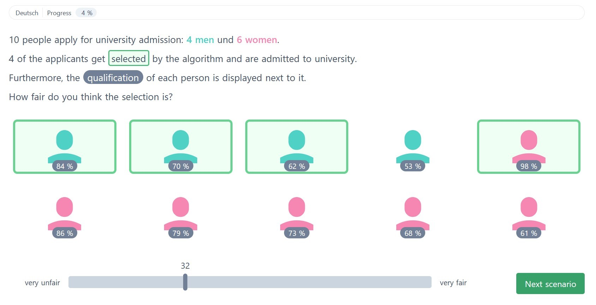

# FairCeptron

## Abstract

> Measures of algorithmic fairness often do not account for
human perceptions of fairness that can substantially vary
between different sociodemographics and stakeholders. The
FairCeptron framework is an approach for studying perceptions
of fairness in algorithmic decision making such as in
ranking or classification. It supports (i) studying human perceptions
of fairness and (ii) comparing these human perceptions
with measures of algorithmic fairness. The framework
includes fairness scenario generation, fairness perception
elicitation and fairness perception analysis. This implementation
of the FairCeptron framework can easily be adapted to study perceptions of
algorithmic fairness in other application contexts. We hope
our work paves the way towards elevating the role of studies
of human fairness perceptions in the process of designing
algorithmic decision making systems.

This repo contains the web app used for _fairness perception elicitation_, that can be deployed as described below. For _fairness scenario generation_ and _fairness perception analysis_, check out [FairCeptron notebooks](https://github.com/cssh-rwth/fairceptron-notebooks).



This universal web app is written with [Nuxt.js](https://nuxtjs.org) and [TailwindCSS](https://tailwindcss.com/) and includes a simple backend as Nuxt server middleware. The backend is implemented with [Express](https://expressjs.com/) and [Mongoose](https://mongoosejs.com/) to connect to a [MongoDB](https://www.mongodb.com/) server that stores pre-generated scenarios and participants' answers.

## Deploy with Docker

First, create secret credentials in `.env` (see `.env.example`).
Then, setup the Nuxt.js webserver including the Express.js backend and the MongoDB database with

```bash
$ docker-compose up --build -d
```

Make sure to populate the database with questions after deploying for the first time.

## Nuxt.js Build Setup

To start only the Nuxt.js server with an external database, configure the database connection in `.env`.
Then run

```bash
# install dependencies
$ npm install

# serve with hot reload at localhost:3000
$ npm run dev

# build for production and launch server
$ npm run build
$ npm run start
```

Check out [Nuxt.js docs](https://nuxtjs.org) for more information on Nuxt.js.
